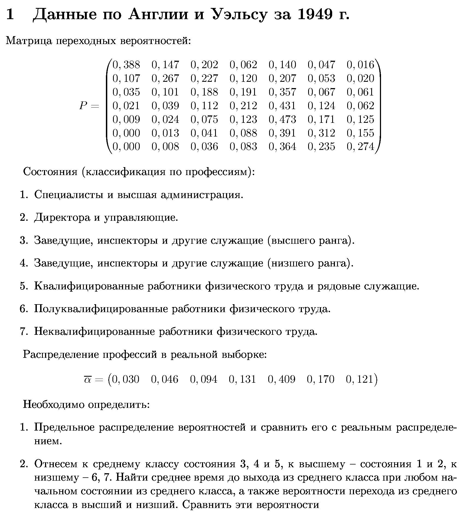
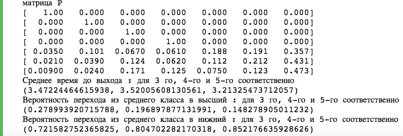

# marcov-chain
Задача 1: генетическая проблема

Результаты:

1) Различные матрицы : 

Матрица B зависит от k. Среднее время до образования чистой породы T_average растет с ростом k

2) Графики:

График зависимости среднего времени до образования чистой породы от k

График зависимости вероятности попадание в состояние доминант от k

График зависимости вероятности попадание в состояние рецессив от k

Задача 2 : 

Решение : 
1) ( 0.02264569  0.04143566  0.08754891  0.12723427  0.40993508  0.18216062 0.12903977 )
Сравнение с исходным распределением. Почти по всем профессиям исходное распределение дает большую вероятность :
(-0.00735431 -0.00456434 -0.00645109 -0.00376573  0.00093508  0.01216062 0.00803977) 

2)

